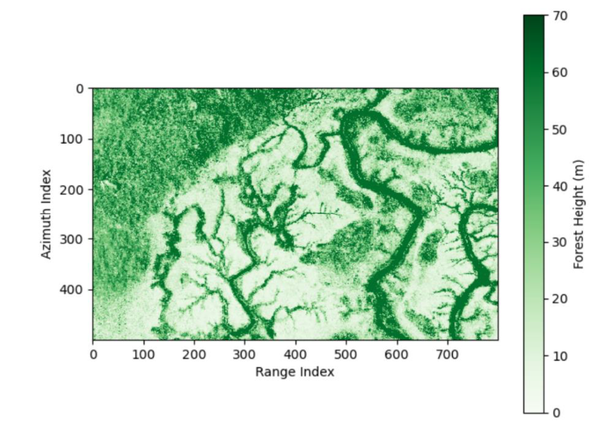

---
hide:
  - toc
---
<!--
CHECKLIST FOR THIS PAGE:
- [ ] Replace the two placeholder cards (marked [YOUR PROJECT ...]) with your real projects
- [ ] For each project: add a thumbnail image to docs/assets/images/ and update the path below
- [ ] For each project: create a project page by copying sample-project.md
- [ ] For each project: add a nav entry in mkdocs.yml (see the comments there)
- [ ] Delete placeholder cards you don't need yet
-->

# Projects

A selection of my geospatial projects. Click any card to see the full write-up.

**[Large-Scale Forest Height Estimation Using UAVSAR PolInSAR Data](uavsar-polinsar-forest-height.md)**

PolInSAR-based forest canopy height retrieval over Pongara National Park, Gabon using NASA UAVSAR data and the Kapok Python library. Coursework project for *Synthetic Aperture Radar in Forest Application* at TUM.

`Python` `Kapok` `PolInSAR`

[View Project →](uavsar-polinsar-forest-height.md){ .md-button }

**[Sample Notebook](sample-notebook.ipynb)**

[YOUR PROJECT DESCRIPTION — one or two sentences: what you did, what data you used,
and what you found or built.]

`Python` `pandas` `Folium`

[View Project →](sample-notebook.ipynb){ .md-button }

